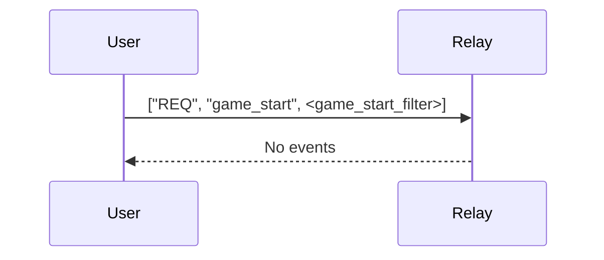
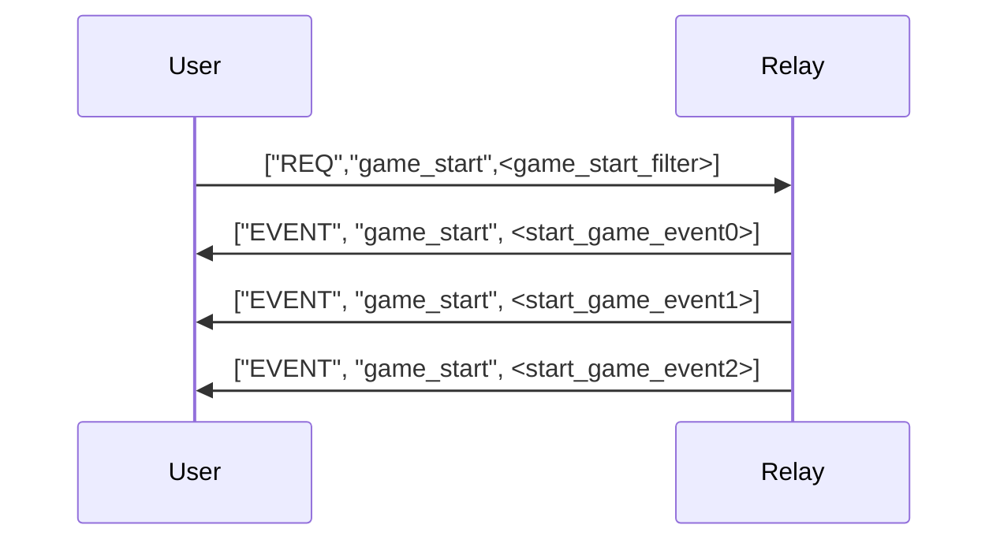
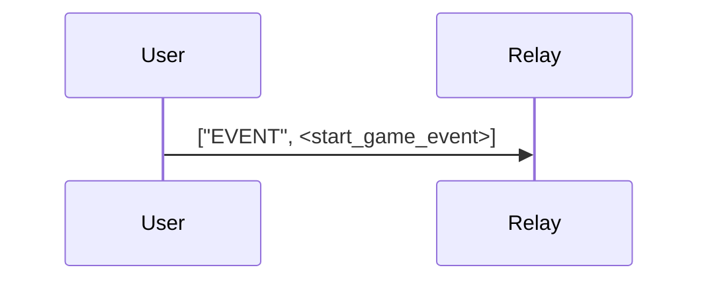
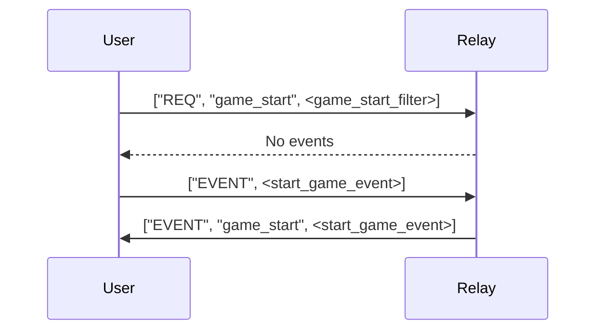
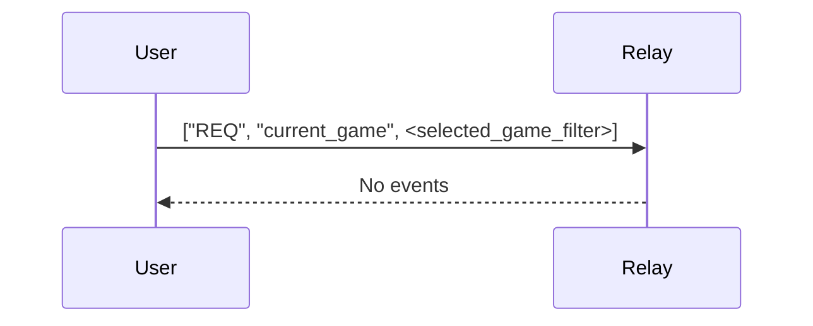

# jester

This document is work in progress. Information is probably outdated. Dont't trust, verify.

## Table of Contents

- [Overview](#overview)
- [Game Start](#game-start)
  - [Game Start Subscription](#game-start-subscription)
  - [Game Start Event](#game-start-event)
  - [Game Start Examples](#game-start-examples)
- [Game Move](#game-move)
  - [Game Move Subscription](#game-move-subscription)
  - [Game Move Event](#game-move-event)
  - [Game Move Examples](#game-move-examples)
- [Direct Challenge](#direct-challenge)
  - [Direct Challenge Subscription](#direct-challenge-subscription)
  - [Direct Challenge Event](#direct-challenge-event)
  - [Direct Challenge Examples](#direct-challenge-examples)

## Overview

All jester messages use `30` as event `kind`.

TBD.

### Game Start

Game start events are identified by referencing a special event id which is derived from the start fen value:
```shell
start_fen := "rnbqkbnr/pppppppp/8/8/8/8/PPPPPPPP/RNBQKBNR w KQkq - 0 1"
start_fen_event_id = sha256(start_fen)
// b1791d7fc9ae3d38966568c257ffb3a02cbf8394cdb4805bc70f64fc3c0b6879
```

#### Game Start Subscription
A subscription to game start events
```json
["REQ", "game_start", {
  "#e": ["b1791d7fc9ae3d38966568c257ffb3a02cbf8394cdb4805bc70f64fc3c0b6879"],
  "kinds": [30],
  "since": 1234567890
}]
```

```shell
game_start_filter := ["REQ", "game_start", {
  "#e": ["b1791d7fc9ae3d38966568c257ffb3a02cbf8394cdb4805bc70f64fc3c0b6879"],
  "kinds": [30],
  "since": 1234567890
}]
```

#### Game Start Event
```json
{
  "kind": 30,
  "content": "{\"version\":\"0\",\"kind\":0,\"history\":[],\"nonce\":\"abcdef42\"}",
  "tags": [[ "e", "b1791d7fc9ae3d38966568c257ffb3a02cbf8394cdb4805bc70f64fc3c0b6879" ]],
  // [...]
}
```
e.g.
```json
{
  "id": "203e6b95ef52199253308a2c521fc261a60e575b3ad63828031ca4220272702c",
  "kind": 30,
  "pubkey": "b61488fc1a66779d8ec26be4956ab740807cd0c27926a9f79deef867d2e29bc7",
  "content": "{\"version\":\"0\",\"kind\":0,\"history\":[],\"nonce\":\"abcdef42\"}",
  "tags": [
    [
      "e",
      "b1791d7fc9ae3d38966568c257ffb3a02cbf8394cdb4805bc70f64fc3c0b6879"
    ]
  ],
  "created_at": 1234567890,
  "sig": "e337fbabc2b9ded09ed6d2e959e7c9087f69c206feec1a9148e12f46761c4d0df67b6b529aba69b6f245d62ef3b891468abc15f99d98160289a727f76f3e26c5"
}
```

#### Game Start Examples
##### No game started

If no game has been started, you can provide an option to let the user start a game.
For this, you need to publish a game, referencing `b1791d7fc9ae3d38966568c257ffb3a02cbf8394cdb4805bc70f64fc3c0b6879`.


#### Games received


Always expect multiple games to be started. Client can choose one their own which one to follow.

#### Start a game


If you are correctly subscribed with a `game_start_filter` the server will immediately playback the event to you:



### Game Move

A game move is something that references a previous move and the game start event it belongs to.
The first move event in a game has no previous move and references the start event only.

Contents of a move event consists of properties:
- `version`
- `kind` (always `1`)
- `fen`
- `move`
- `history`

This format is subject to change!
(e.g. removal of redundant information like `fen` and `history`)

Example:
```json
{
  "version": "0",
  "kind": 1,
  "fen": "rnbqkbnr/pppppppp/8/8/4P3/8/PPPP1PPP/RNBQKBNR b KQkq e3 0 1",
  "move": "e4",
  "history": ["e4"]
}
```

#### Game Move Subscription 

If you have selected a game, e.g with id `f2663b7b5f26e334e7bf89b19afa6aa138a46d4af02c37f98b07e1e18eaefd4f`,
a subscription must created that fetches move events referencing the game start event.

```json
["REQ", "current_game", {
    "ids":["f2663b7b5f26e334e7bf89b19afa6aa138a46d4af02c37f98b07e1e18eaefd4f"],
    "kinds":[30]
  }, {
    "#e":["f2663b7b5f26e334e7bf89b19afa6aa138a46d4af02c37f98b07e1e18eaefd4f"],
    "kinds":[30]
  }
]
```
`ids` (optional): will playback the start event itself
`#e`: will provide any actual move events referencing the start event.

```shell
selected_game_filter := ["REQ","current_game", {
    "ids":["f2663b7b5f26e334e7bf89b19afa6aa138a46d4af02c37f98b07e1e18eaefd4f"],
    "kinds":[30]
  }, {
    "#e":["f2663b7b5f26e334e7bf89b19afa6aa138a46d4af02c37f98b07e1e18eaefd4f"],
    "kinds":[30]
  }
]
```



From now on, the client will receive game move updates.

#### Game Move Event

TBD

#### Game Move Examples

First move in a game:
```json
{
  "id":"690aba4203682f5d0c33b75dd7687042f46323d56d76b3042c5ee36a92ff4571",
  "kind":30,
  "pubkey":"147ad8c3426f80647c69fb73a947c9d15b07ce4073d18bab9d36c27a8543fc91",
  "content":"{\"version\":\"0\",\"kind\":1,\"fen\":\"rnbqkbnr/pppppppp/8/8/4P3/8/PPPP1PPP/RNBQKBNR b KQkq e3 0 1\",\"move\":\"e4\",\"history\":[\"e4\"]}",
  "tags":[
    ["e","f2663b7b5f26e334e7bf89b19afa6aa138a46d4af02c37f98b07e1e18eaefd4f"],
    ["e","f2663b7b5f26e334e7bf89b19afa6aa138a46d4af02c37f98b07e1e18eaefd4f"]
  ],
  "created_at":1653237822,
  "sig":"0151a2bbd7271e29af47f7a8d1449b513cc3d7f7eb586e021120c8a6d2f69ea2ff00c9186bf286b47e47116333b25573fe1a3f17dc705c2c64ad0e8dcbd67109"
}
```

TBD

### Direct Challenge

TBD

#### Direct Challenge Subscription

TBD

#### Direct Challenge Event

TBD

#### Direct Challenge Examples

TBD
