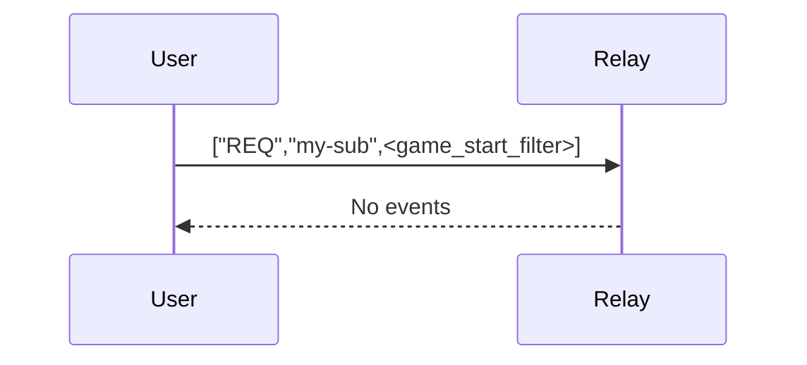
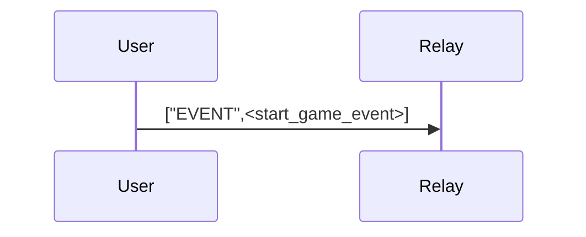
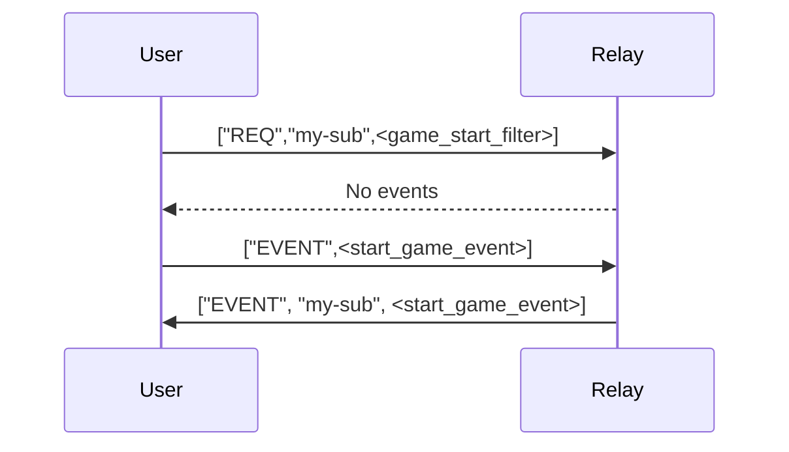
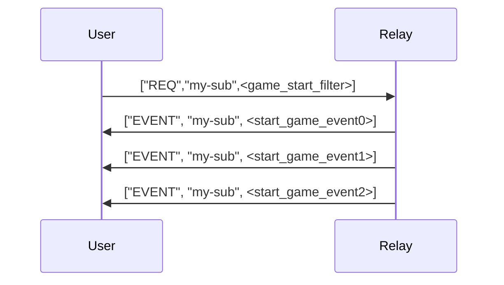
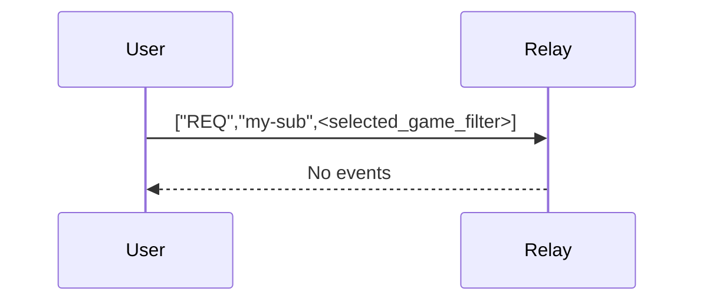

```
start_fen := "rnbqkbnr/pppppppp/8/8/8/8/PPPPPPPP/RNBQKBNR w KQkq - 0 1"
start_fen_event_id = sha256('start_fen)
// b1791d7fc9ae3d38966568c257ffb3a02cbf8394cdb4805bc70f64fc3c0b6879
```

A subscription to game start events
```json
["REQ","my-sub",{"#e": ["b1791d7fc9ae3d38966568c257ffb3a02cbf8394cdb4805bc70f64fc3c0b6879"]}]
```

```
game_start_filter := ["REQ","my-sub",{"#e": ["b1791d7fc9ae3d38966568c257ffb3a02cbf8394cdb4805bc70f64fc3c0b6879"]}]
```

## Before game
### No game started

If no game has been started, you can provide an option to let the user start a game.
For this, you need to publish a game, referencing `b1791d7fc9ae3d38966568c257ffb3a02cbf8394cdb4805bc70f64fc3c0b6879`.

#### Start a game

```json
{
  "kind": 1,
  "content": "",
  "tags": [["e", "b1791d7fc9ae3d38966568c257ffb3a02cbf8394cdb4805bc70f64fc3c0b6879"]],
  // [...]
}
```
e.g.
```json
{
  "id": "203e6b95ef52199253308a2c521fc261a60e575b3ad63828031ca4220272702c",
  "kind": 1,
  "pubkey": "b61488fc1a66779d8ec26be4956ab740807cd0c27926a9f79deef867d2e29bc7",
  "content": "",
  "tags": [
    [
      "e",
      "b1791d7fc9ae3d38966568c257ffb3a02cbf8394cdb4805bc70f64fc3c0b6879"
    ]
  ],
  "created_at": 1648153711,
  "sig": "e337fbabc2b9ded09ed6d2e959e7c9087f69c206feec1a9148e12f46761c4d0df67b6b529aba69b6f245d62ef3b891468abc15f99d98160289a727f76f3e26c5"
}
```


If you are correctly subscribed with a `game_start_filter` the server will immediately playback the event to you:




### Game received


Always expect multiple games to be started. Client can choose one their own which one to follow.

### Game selected

If you have selected a game, the subscription must be updated to
A subscription to game start events
```json
["REQ","my-sub",{"#e": ["<selected_game_id>"]}]
```

```
selected_game_filter := ["REQ","my-sub",{"#e": ["<selected_game_id>"]}]
```



From now on, the client will receive game move updates.
